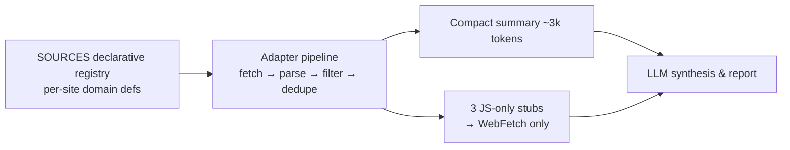

# tech-event-scout (English)

A multi-host agent plugin for AI/tech event intelligence. **A codebase aggregator
deterministically collects and filters 9 sources; the LLM reads only a compact summary
(~3k tokens) and synthesizes the report** — minimal search dependence, minimal token cost.

[한국어 README](README.md) · [Collection sources](docs/sources.md)

## Architecture



- **collect.py** (pure Python stdlib, zero deps): declarative source table → one adapter
  pipeline. Adding a source is one dict entry.
- Date-window, keyword, and dedupe filters run in code — ~90% fewer input tokens than
  pure-LLM fetching (investigation tool cost ≈ $0.07 per run).

## Code-collected sources (9)

| Type | Sources |
|------|---------|
| Venue calendars | COEX (date query + pagination), KINTEX (`searchStartDt`), BEXCO (`schStartDate` + pages) |
| Platforms | AWS Summits (embedded JSON) |
| Aggregators | SLEXN, Dev-Event (GitHub), onoffmix (2 keyword queries), Luma Seoul (`__NEXT_DATA__`) |

Three JS-only sources (Event-us, Anthropic, OpenAI DevDay) are emitted as stubs for the
agent to WebFetch.

## Coverage

- **Cloud**: AWS Summits (worldwide), re:Invent, Google Cloud Next
- **AI platforms**: OpenAI DevDay (+ DevDay Exchange Seoul), Anthropic, GCP webinars
- **Korea flagship**: AI Summit Seoul, AI Festa, KES, Industrial AI EXPO, AIoT Korea, Softwave
- **Community**: AWSKRUG, Docker/n8n meetups, hackathons, CFPs, webinars (virtual counts)

## Example prompts

- "Research AI/tech events at COEX and KINTEX for Sep–Oct."
- "Summarize upcoming AWS and OpenAI dates plus registration deadlines."
- "Any conference CFPs closing in the next 3 months?"

## Run directly

```bash
python3 skills/tech-event-scout/scripts/collect.py --start 20260901 --end 20261031
```

## Install

```bash
# Claude Code
claude plugin marketplace add epicsagas/plugins
claude plugin install tech-event-scout@epicsagas

# Codex
codex plugin marketplace add epicsagas/plugins
codex plugin add tech-event-scout@epicsagas

# agy (repo URL, no .git)
agy plugin install https://github.com/epicsagas/tech-event-scout
agy plugin enable tech-event-scout

# hermes (repo URL)
hermes plugins install https://github.com/epicsagas/tech-event-scout
hermes plugins enable tech-event-scout
# If skills_guard blocks the install (AGENTS.md → CRITICAL persistence),
# disable plugins.scan_on_install in hermes config.
```

## License

MIT
