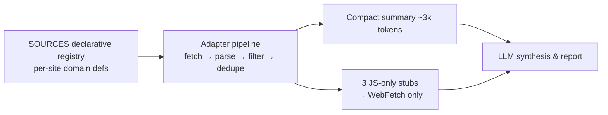

# tech-event-scout (English)

[한국어](README.md) | **[English](README.en.md)**

<p align="center">
  <a href="https://github.com/epicsagas/tech-event-scout/stargazers"></a>
  <a href="https://github.com/epicsagas/tech-event-scout/network/members"></a>
  <a href="https://github.com/epicsagas/tech-event-scout/issues"></a>
  <a href="https://github.com/epicsagas/tech-event-scout/commits/main"></a>
  <a href="LICENSE"></a>
</p>

A multi-host agent plugin for AI/tech event intelligence. **A codebase aggregator
deterministically collects and filters 9 sources; the LLM reads only a compact summary
(~3k tokens) and synthesizes the report** — minimal search dependence, minimal token cost.

<p align="center">
  
</p>

## Architecture



- **collect.py** (pure Python stdlib, zero deps): declarative source table → one adapter
  pipeline. Adding a source is one dict entry.
- Date-window, keyword, and dedupe filters run in code — ~90% fewer input tokens than
  pure-LLM fetching (investigation tool cost ≈ $0.07 per run).

## Code-collected sources (9)

| Type | Sources |
|------|---------|
| Exhibition schedules | COEX (date query + pagination), KINTEX (`searchStartDt`), BEXCO (`schStartDate` + pages) |
| Platforms | AWS Summits (embedded JSON) |
| Aggregators | SLEXN, Dev-Event (GitHub), onoffmix (2 keyword queries), Luma Seoul (`__NEXT_DATA__`) |

Per-source query patterns and detail-link extraction rules: [docs/sources.md](docs/sources.md).

Three JS-only sources (Event-us, Anthropic, OpenAI DevDay) are emitted as stubs for the
agent to WebFetch.

## Why tech-event-scout?

| | tech-event-scout | Pure LLM search | Manual calendar checks |
|-|------------------|-----------------|------------------------|
| Input tokens per run | **~3k** | 50–100k+ | — |
| Ended-event false hits | Reads venue calendars directly — low | Search mixes past editions | Low |
| Per-source date queries | Handled in code | Re-assembled every run | Manual |
| Maintenance | One dict entry per source | Prompt-dependent | Tens of minutes weekly |
| Determinism | Same input → same output | Non-deterministic | — |

## Coverage

- **Cloud**: AWS Summits (worldwide), re:Invent, Google Cloud Next
- **AI platforms**: OpenAI DevDay (+ DevDay Exchange Seoul), Anthropic, GCP webinars
- **Korea flagship**: AI Summit Seoul, AI Festa, KES, Industrial AI EXPO, AIoT Korea, Softwave
- **Community**: AWSKRUG, Docker/n8n meetups, hackathons, CFPs, webinars (virtual counts)

## Example prompts

**Flagship research**
- "Research AI/tech events at COEX and KINTEX for Sep–Oct."
- "All developer conferences in Seoul this quarter."
- "Any tech events at BEXCO (Busan)?"

**Global platforms**
- "Summarize upcoming AWS and OpenAI dates plus registration deadlines."
- "World Summit AI — when and where this year? Tickets still available?"
- "Is the re:Invent early-bird deadline close?"

**Deadlines**
- "Any conference CFPs closing in the next 3 months?"
- "Only events whose registration closes this month."
- "Where do I apply for DevDay Exchange Seoul?"

**Community & meetups**
- "AI meetups or hackathons in Seoul this week?"
- "When is the next AWSKRUG session?"
- "Online webinars presented in Korean only."

**Research & verification**
- "The COEX calendar shows AI Festa in October — verify against the official site." (cross-checks venue calendar errors)
- "Infer next editions of events I missed last month from their annual cycle."

## Run directly

```bash
python3 skills/tech-event-scout/scripts/collect.py --start 20260901 --end 20261031
```

## Install

```bash
# Claude Code
claude plugin marketplace add epicsagas/plugins
claude plugin install tech-event-scout@epicsagas

# Codex
codex plugin marketplace add epicsagas/plugins
codex plugin add tech-event-scout@epicsagas

# agy (repo URL, no .git)
agy plugin install https://github.com/epicsagas/tech-event-scout
agy plugin enable tech-event-scout

# hermes (repo URL)
hermes plugins install https://github.com/epicsagas/tech-event-scout
hermes plugins enable tech-event-scout
# If skills_guard blocks the install (AGENTS.md → CRITICAL persistence),
# disable plugins.scan_on_install in hermes config.
```

## License

MIT
