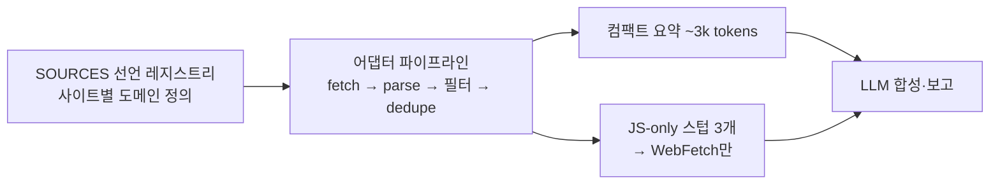

# tech-event-scout

AI·테크 행사 intelligence 멀티호스트 에이전트 플러그인. **코드베이스 어그리게이터가 9개 소스를
결정론적으로 수집·필터링하고, LLM은 컴팩트 요약만 읽고 합성·보고합니다** — 검색 의존 최소화,
토큰 비용 최소화.

[English README](README.en.md) · [수집 소스 리스트](docs/sources.md)

## 아키텍처



- **collect.py** (Python 표준 라이브러리만, 의존성 0): 선언적 소스 테이블 → 단일 어댑터 파이프라인.
  소스 추가는 딕셔너리 한 줄
- **날짜 창 필터 + 키워드 필터 + 중복 제거**를 코드에서 처리 — LLM 유입 토큰을 순수 LLM 패치
  대비 ~90% 절감 (회당 조사 도구분 ≈ $0.07)

## 코드 수집 소스 (9)

| 분류 | 소스 |
|------|------|
| 공연장 달력 | 코엑스(날짜 쿼리+페이지네이션), 킨텍스(`searchStartDt`), 벡스코(`schStartDate`+페이지) |
| 플랫폼 | AWS Summits (임베디드 JSON) |
| 애그리게이터 | SLEXN, Dev-Event(GitHub), onoffmix(키워드 2건), Luma Seoul(`__NEXT_DATA__`) |

JS 전용 3개(이벤터스·Anthropic·OpenAI DevDay)는 스텁으로 출력 → LLM이 WebFetch.

## 커버리지

- **클라우드**: AWS Summit(전 세계)·re:Invent, Google Cloud Next
- **AI 플랫폼**: OpenAI DevDay(+DevDay Exchange Seoul), Anthropic, GCP 웨비나
- **국내 대형**: AI Summit Seoul, 인공지능 페스타, KES, 산업AI EXPO, AIoT Korea, 소프트웨이브
- **커뮤니티**: AWSKRUG, Docker·n8n 밋업, 해커톤, CFP, 웨비나(온라인 포함)

## 사용 예시

- "9~10월 코엑스·킨텍스 AI/테크 행사 조사해 줘"
- "AWS와 OpenAI 다음 일정 + 등록 마감 정리"
- "3개월 내 CFP 마감 컨퍼런스 있어?"

## 직접 실행

```bash
python3 skills/tech-event-scout/scripts/collect.py --start 20260901 --end 20261031
```

## 설치

```bash
# Claude Code
claude plugin marketplace add epicsagas/plugins
claude plugin install tech-event-scout@epicsagas

# Codex
codex plugin marketplace add epicsagas/plugins
codex plugin add tech-event-scout@epicsagas

# agy (repo URL, no .git)
agy plugin install https://github.com/epicsagas/tech-event-scout
agy plugin enable tech-event-scout

# hermes (repo URL)
hermes plugins install https://github.com/epicsagas/tech-event-scout
hermes plugins enable tech-event-scout
# 설치가 skills_guard에 막힌다면(AGENTS.md → CRITICAL persistence)
# hermes 설정에서 plugins.scan_on_install: false 로 끄세요.
```

## 라이선스

MIT
