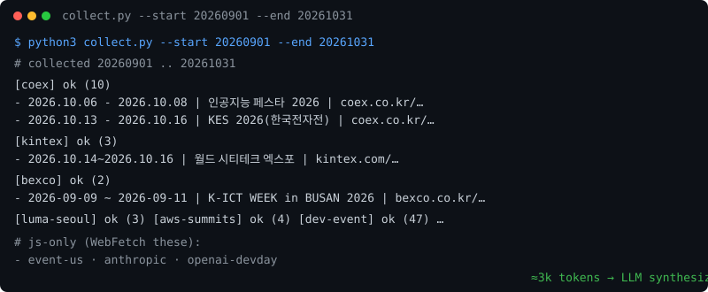
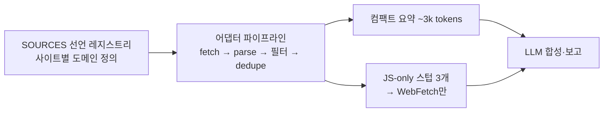

# tech-event-scout

**[한국어](README.md)** | [English](README.en.md)

<p align="center">
  <a href="https://github.com/epicsagas/tech-event-scout/stargazers"></a>
  <a href="https://github.com/epicsagas/tech-event-scout/network/members"></a>
  <a href="https://github.com/epicsagas/tech-event-scout/issues"></a>
  <a href="https://github.com/epicsagas/tech-event-scout/commits/main"></a>
  <a href="LICENSE"></a>
</p>

AI·테크 행사 intelligence 멀티호스트 에이전트 플러그인. **코드베이스 어그리게이터가 9개 소스를
결정론적으로 수집·필터링하고, LLM은 컴팩트 요약만 읽고 합성·보고합니다** — 검색 의존 최소화,
토큰 비용 최소화.

<p align="center">
  
</p>

## 아키텍처



- **collect.py** (Python 표준 라이브러리만, 의존성 0): 선언적 소스 테이블 → 단일 어댑터 파이프라인.
  소스 추가는 딕셔너리 한 줄
- **날짜 창 필터 + 키워드 필터 + 중복 제거**를 코드에서 처리 — LLM 유입 토큰을 순수 LLM 패치
  대비 ~90% 절감 (회당 조사 도구분 ≈ $0.07)

## 코드 수집 소스 (9)

| 분류 | 소스 |
|------|------|
| 전시일정 | 코엑스(날짜 쿼리+페이지네이션), 킨텍스(`searchStartDt`), 벡스코(`schStartDate`+페이지) |
| 플랫폼 | AWS Summits (임베디드 JSON) |
| 애그리게이터 | SLEXN, Dev-Event(GitHub), onoffmix(키워드 2건), Luma Seoul(`__NEXT_DATA__`) |

소스별 조회 패턴·상세 링크 추출 규칙은 [docs/sources.md](docs/sources.md) 참고.

## 왜 tech-event-scout인가

| | tech-event-scout | 순수 LLM 검색 | 수동 달력 확인 |
|-|------------------|---------------|---------------|
| 조사 1회 입력 토큰 | **≈3k** | 50–100k+ | — |
| 종료된 행사 오탐 | 원본 달력 직접 → 낮음 | 검색 결과 과거 회차 혼입 | 낮음 |
| 소스별 날짜 쿼리 | 코드가 처리 | 매번 사람/LLM이 조합 | 직접 |
| 유지비용 | 소스 1줄 딕셔너리 | 프롬프트 의존 | 매주 수십 분 |
| 결정론성 | 동일 입력→동일 출력 | 비결정론 | — |

JS 전용 3개(이벤터스·Anthropic·OpenAI DevDay)는 스텁으로 출력 → LLM이 WebFetch.

## 커버리지

- **클라우드**: AWS Summit(전 세계)·re:Invent, Google Cloud Next
- **AI 플랫폼**: OpenAI DevDay(+DevDay Exchange Seoul), Anthropic, GCP 웨비나
- **국내 대형**: AI Summit Seoul, 인공지능 페스타, KES, 산업AI EXPO, AIoT Korea, 소프트웨이브
- **커뮤니티**: AWSKRUG, Docker·n8n 밋업, 해커톤, CFP, 웨비나(온라인 포함)

## 사용 예시

**대형 행사 조사**
- "9~10월 코엑스·킨텍스 AI/테크 행사 조사해 줘"
- "이번 분기 서울에서 열리는 개발자 컨퍼런스 전부"
- "부산(벡스코) 테크 행사 있어?"

**글로벌 플랫폼**
- "AWS와 OpenAI 다음 일정 + 등록 마감 정리"
- "World Summit AI 올해 언제 어디서? 티켓 아직 살 수 있어?"
- "re:Invent 얼리버드 마감 임박했나?"

**마감·일정 관리**
- "3개월 내 CFP 마감 컨퍼런스 있어?"
- "이번 달 안에 등록 마감하는 행사만 뽑아줘"
- "DevDay Exchange 서울 신청 어디서 해?"

**커뮤니티·밋업**
- "이번 주 서울 AI 밋업·해커톤 뭐 있지?"
- "AWSKRUG 다음 소모임 일정 알려줘"
- "온라인 웨비나 중 한국어 진행되는 것만"

**리서치·검증**
- "인공지능 페스타가 코엑스 달력에 10월로 떴는데 공식 사이트 확인해 줘" (달력 오류 교차검증)
- "지난달 놓친 행사 중 다음 회차 예상되는 것 연간 주기로 추론해 줘"

## 직접 실행

```bash
python3 skills/tech-event-scout/scripts/collect.py --start 20260901 --end 20261031
```

## 설치

```bash
# Claude Code
claude plugin marketplace add epicsagas/tech-event-scout
claude plugin install tech-event-scout@tech-event-scout

# Codex
codex plugin marketplace add epicsagas/tech-event-scout
codex plugin add tech-event-scout@tech-event-scout

# agy (repo URL, no .git)
agy plugin install https://github.com/epicsagas/tech-event-scout
agy plugin enable tech-event-scout

# Grok Build (xAI)
grok plugin marketplace add epicsagas/tech-event-scout
grok plugin install epicsagas/tech-event-scout --trust

# hermes (repo URL)
hermes plugins install https://github.com/epicsagas/tech-event-scout
hermes plugins enable tech-event-scout
# 설치가 skills_guard에 막힌다면(AGENTS.md → CRITICAL persistence)
# hermes 설정에서 plugins.scan_on_install: false 로 끄세요.
```

## 라이선스

MIT
